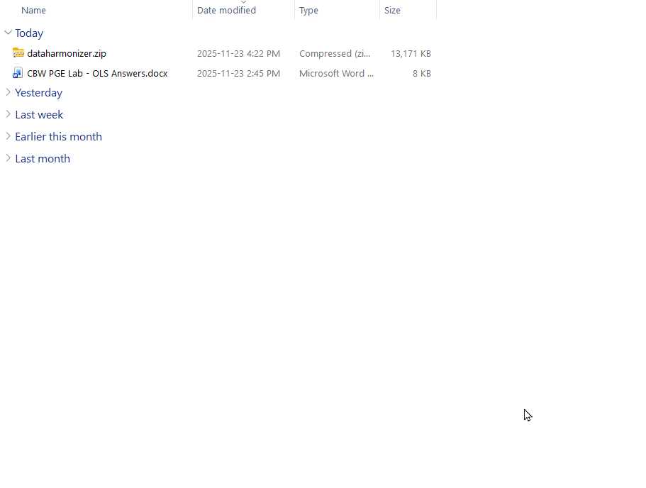

# Module 1 Data Curation and Data Sharing

## Lecture

<iframe src="https://docs.google.com/presentation/d/11MghMiN8TMiOfagUvzOqgyE8xbHlXB3P/preview" width="640" height="480" allow="autoplay"></iframe>  

## Lab

*Author: Emma Griffiths and Charlie Barclay*

*Last Modified: 2025-11-23*

1. [Overview](#intro1)
2. [Part 1: Exploring data heterogeneity across repositories](#exercise1)
3. [Part 2: DataHarmonizer demonstration](#exercise2)
4. [Part 3: Curation using the DataHarmonizer](#exercise3)
5. [Part 4: EBI OLS](#exercise4)

### Background {#intro1}

High quality contextual data (often described as metadata) is essential for genomic epidemiology workflows from MLST and cgMLST profiling to clustering, phylogenetics, and outbreak interpretation. While public repositories can be a useful source in identifying data, the associated contextual data is often heterogeneous, inconsistent or incomplete and analytical tools rely on standardised inputs to produce reliable results.

The PGE Data curation and sharing lab is designed to give participants hands-on experience using curation methods and standardisation tools to prepare real-world datasets for downstream analysis. Across the integrated exercises, participants will explore repository variation, learn how to structure and validate contextual data using the DataHarmonizer, curate three datasets for use in later modules, and apply ontologies to ensure terminological consistency across sources.

The session emphasizes reproducibility, interoperability, and the role of contextual data standards in ensuring robust genomic analysis.

The lab experience is divided into four parts that consist of: 

- An **exploratory exercise** to review the content and structure of contextual data within public repository records (NCBI and BV-BRC). 
- A **demonstration** of a data curation and validation tool called the **DataHarmonizer**.
- A **data curation** exercise where participants practice interpreting and structuring  three contextual datasets, to create analysis-ready contextual data for later modules in the workshop series.
- An **ontology search exercise** using the EBI OLS to look up standardised ontology equivalents for selected terms to build their own controlled vocabulary list to improve semantic consistency.

### Exploring data heterogeneity across repositories {#exercise1}

**Aim:** To observe and compare how contextual; data for the same bacterial samples (MRSA) are represented in two public repositories, BV-BRC and NCBI BioSample, and to identify inconsistencies that affect downstream analyses such as pathogen identification, outbreak investigation, and phylodynamics.

1. Access the repository: BV-BRC [Bacterial and Viral Bioinformatics Resource Center](https://www.bv-brc.org/)
2. Use the search dropdown to select *Genomes* and type *Staphylococcus aureus* into the search bar.
3. Filter your seach for:
    i.  **Keywords:** MRSA
    ii. **Collection year:** 2009
    iii. **Isolation country:** Australia

:::: {.callout type="blue" style="subtle" title="Checkpoint: How many results did you get?" collapsible="true"}

Answer: 41. If you look at the bottom of the page you should see **1 - 41 of 41 results** (correct as of 23rd November)

::::

4. Click on collection year again to remove the filter. Instead filter by 2004 
5. Select the second record **Staphylococcus aureus strain JKD6004**.
6. Review the details pane to identify the contextual information including the BioSample accession number.
7. Review the same sample in NCBI BioSample repository:
    i. In the details pane, follow the link to the appropriate BioSample.
    ii. Alternatively, copy the accession number (e.g., SAMN12345678 or equivalent) from the BV-BRC record and paste it into the NCBI BioSample search bar.
8. Compare contextual data fields between the two repositories. 

::: {.callout type="purple"} 

**Tip: Public Repositories Are Not Standards**

You may notice that the same sample looks different between BV-BRC and NCBI.  

This is expected — **repositories store records as they were submitted**, and those submissions often use inconsistent formats, missing fields, or non-standard terminology.  

This is why we need curation + standards **before** analysis, even when using “trusted” databases.

:::

### DataHarmonizer demonstration {#exercise2}

The **DataHarmonizer** is a spreadsheet based validation tool which facilitates the application of data standards. The instructor will provide a brief overview of the DataHarmonizer tool, with examples of how to enter, validate and transform data for repository submission. 

To complete the curation exercises participants can use a test version of the DataHarmonizer, with templates designed for this course. Participants can find the test version of the DataHarmonizer on their student instances under module1. The tool will need extracting prior to use.

1. Download and unzip the DataHarmonizer
    i. Go to your workspace at http://##.uhn-hpc.ca/ *replace the ## with your student number*
    ii. Navigate into the folder CourseData/module1
    iii. Download the provided dataharmonizer.zip
    iv. Extract (unzip) the folder to a location on your computer where you can easily find it.
2. Open the DataHarmonizer: Inside the extracted folder, navigate to dist → index.html. Double click index.html to open the tool.
3. Follow along with the demonstration. The instructor will:
    i. Introduce the interface including layout, menus and the validation feature.
    ii. Explain how the templates encode standards e.g. how the required vs recommended fields are indicated.
    iii. Demonstrate entering data into a few fields.
    iv. Show the data after ‘validation’.

:::: {.callout type="purple"}

Note that in the address bar, the local address for the app is stored. The application is local to your machine and no data is shared online.

::::

**Alternative link:** If unable to download through your student instance then you can download the [dataharmonizer.zip](https://drive.google.com/uc?export=download&id=1mfLHfzPVOA6avBEoFhiAsIMfXuBrIMQp). Unzip the folder and open the interface by going to the dist folder and navigating to 'main.html'.

### Curation using the DataHarmonizer {#exercise3}

In this exercise, participants will curate three datasets that will be reused in subsequent workshop modules (pathogen typing, outbreak analysis, and phylodynamics). The aim is to experience practical data cleaning and validation within the DataHarmonizer.

#### 3.1 Curating MRSA data using a One Health AMR data standard

The dataset originates from Bacterial and Viral Bioinformatics Resource Center (BV-BRC) contextual data for Methicillin-resistant Staphylococcus aureus (MRSA) isolates that will be run through chewBBACA for cgMLST allele calling and clustering in a later module. Before running those analyses, participants must ensure the contextual data is properly cleaned and standardised.

1. Locate and download the **3-1_MRSA_AUS_curation.csv** dataset - this can be found at *http://##.uhn-hpc.ca/module1/MRSA_data*  (replace the ## with your student number).
2. Open the **OneHealthCBW** template from the template dropdown.
3. Review the prioritized information and the mapping schema provided by the instructor (included below).
4. Enter the information in the DataHarmonizer template according to the mapping, using the drop down menus where appropriate. 
    i. Start with record **1280_21138** (this should be the first record in the dataset).
    ii. Curate as many records as you can in the given time.
5. Check your curated data against the answer key provided in the Module 1 folder. 

BV-BRC Field | OneHealthCBW Module | OneHealthCBW Field
---|---|---
Genome ID | Database identifiers | BV-BRC genome ID
MLST | Genotyping information | genotyping method
Contigs | Bioinformatics and QC metrics | number of contigs
Size | Bioinformatics and QC metrics | sequence assembly length
CDS | Bioinformatics and QC metrics | number of coding sequences (CDS)
Isolation source | Sample collection and processing | anatomical material
Collection Date | Sample collection and processing | sample collection date
Isolation Country | Sample collection and processing | geo_loc name (country)
Host Common Name | Host information | host (common name)

:::: {.callout type="purple"}

**Additional resources:** Participants interested in curating their own data using the DataHarmonizer after the course are welcome to download the full tool at https://github.com/cidgoh/pathogen-genomics-package/. 

To do so, navigate to the releases page and under the most recent release go to the source code. Download the zip file appropriate for your operating system. Extract the files and continue as before.

::::

#### 3.2 Validating MRSA outbreak data

In this scenario a patient in a hospital was found to be suffering from a foot wound with painful pus-filled sores as well as pneumonia-like symptoms. PCR and culture-based antimicrobial phenotypic testing indicated that the patient was infected with MRSA. Other patients in the hospital were also found to have similar infections in the same week. The data suggested that an outbreak was occurring and so outbreak investigation protocols were triggered. Isolates were sequenced and clusters characterized as part of the evidence used in the investigation.

In order to run the outbreak analyses we need to clean the contextual data. A ‘dirty’ dataset with known contextual data issues is provided. We will open this data in the DataHarmonizer and use the validation feature to tidy this ready for analysis.

1. Locate and download the **3-2_MRSA_outbreak.csv** dataset - this can be found at *http://##.uhn-hpc.ca/module1/MRSA_data*  (replace the ## with your student number).
2. Reset your view by going to File -> New and select ‘Clear’ if you see a pop requesting asking if you would like to clear existing data.
3. Open the downloaded dataset for cleaning: Go to File -> Open -> Choose downloaded file
4. Explore the fields. Note what types of fields are populated. Are there any others you think may be useful for future analysis?
5. Press validate to check for errors and resolve any found.
    i. Use the ‘Next error’ button to navigate through checking for any errors (highlighted in red). 
    ii. Apply corrections, focusing on invalid date formats, geographical locations.
    iii. Once you have fixed all errors press ‘validate’ again. The ‘Next error’ button should disappear.

#### 3.3 Curating SARS-CoV-2 data for phylodynamics analysis

This SARS-CoV-2 dataset is designed for downstream phylodynamics (molecular clock, growth rate estimation, spatiotemporal reconstruction).These analyses require precise and **complete dates** and **geographical resolution** hence, careful contextual data curation is essential.

1. Locate and download the **3-3_SC2_datesUK_small.csv** dataset - this can be found at *http://##.uhn-hpc.ca/module1/SC2_B117_data*  (replace the ## with your student number).
2. For this curation exercise, we need to use a different standard. Switch to the correct template by using the template dropdown and selecting **SC2CBW**.
3. Review the prioritised information and the mapping schema provided by the instructor (included in the table below).
4. In the data identify  Enter the information from the record w in the DataHarmonizer template according to the mapping, using the drop down menus where appropriate.
5. Check your curated data against the **3-3_SC2_small_cleaned.csv** answer key provided in the Module 1 folder. 

Original Field | SC2CBW Module | SC2 Field
---|---|---
Sequence name | Bioinformatics and QC metrics | consensus sequence name
Accession | Database identifiers | INSDC assembly accession
Organism name | Sample collection and processing | number of contigs
Pangolin | Lineage and Variant information | lineage/clade name
PangoVersions | Lineage and Variant information | lineage/clade analysis software name; lineage/clade analysis software version
Length | Bioinformatics and QC metrics | sequence assembly length
Geo-Location | Sample collection and processing | geo_loc name (country); geo_loc name (state/province/territory); geo_loc name (city)
Host | Host information | host (scientific name)
Tissue Specimen Source | Sample collection and processing | anatomical part
Collection Date | Sample collection and processing | sample collection date

:::: {.callout type="purple" style="subtle"}

**Tip: Template Selection Matters**
Each template encodes a *different* data standard.  
If something looks “wrong” — missing fields, unexpected picklists, validation errors — **double-check that you are using the correct template** in the top-right dropdown.

::::

### Using EBI OLS to identify controlled vocabulary {#exercise4}

Identifying standardised terms is key for developing interoperable standards. The EBI’s ontology look-up service (OLS) is an important tool for searching, comparing, and evaluating available vocabulary in different thesauri and ontologies.

Participants will use the lessons and guidance from the lecture component of the lab to identify standardized terms using OLS for capturing the descriptive text provided in the exercise.

Open the link for the [EBI-OLS website](https://www.ebi.ac.uk/ols4/) in any browser. Create the following chart in a text editor:

Description | Standardized label | Ontology ID
---|---|---
Inner lining of the cheek |  | 
Sample collection method - saline mouth rinse |  | 
BAL lung fluid collection |  | 
garbanzo bean |  | 

1. Enter one of the descriptors provided in the OLS search bar and press Search.
2. Examine the list of hits that appear, and consider the following when selecting the best match:
    i. The definition
    ii. The granularity of the suggested term
    iii. The domain of the source ontology
    iv. Reuse of the term in different ontologies
3. Select the best match and capture the standardized label, the ontology ID, and the term definition in the chart.

---------

<iframe src="https://docs.google.com/presentation/d/1_1Xqp5aaopBwsgyKpiXAG5wP192nUmPV/preview" width="640" height="480" allow="autoplay"></iframe>  

### Data Download

[dataharmonizer.zip](https://drive.google.com/file/d/1mfLHfzPVOA6avBEoFhiAsIMfXuBrIMQp/view)
